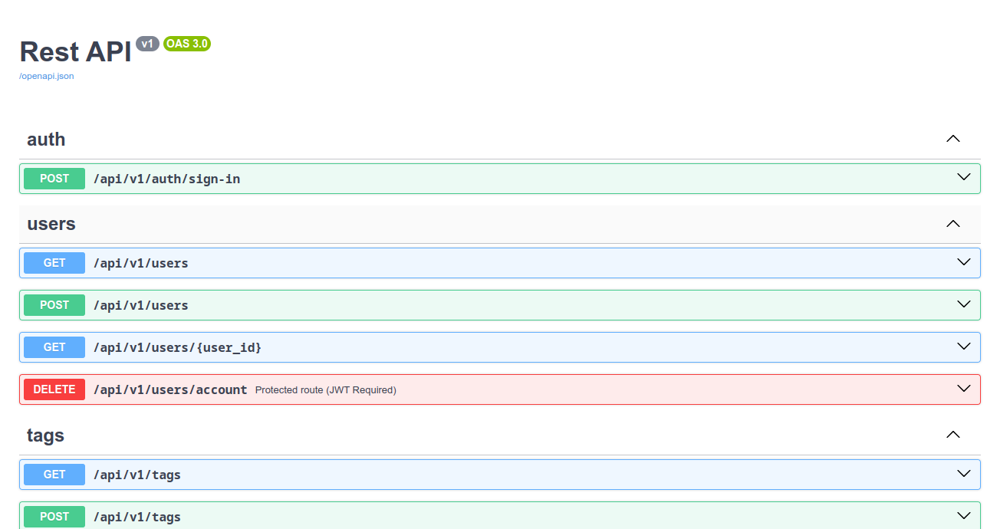
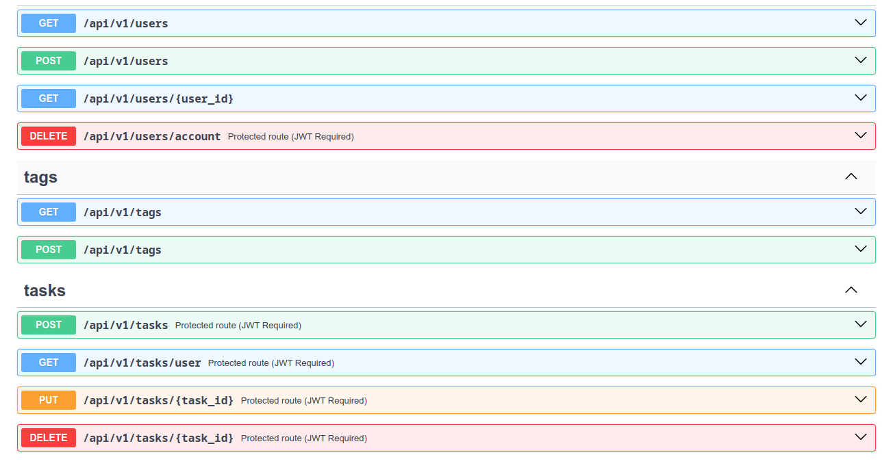
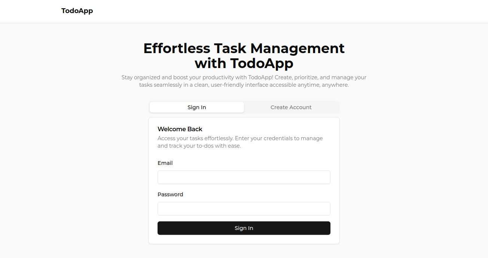
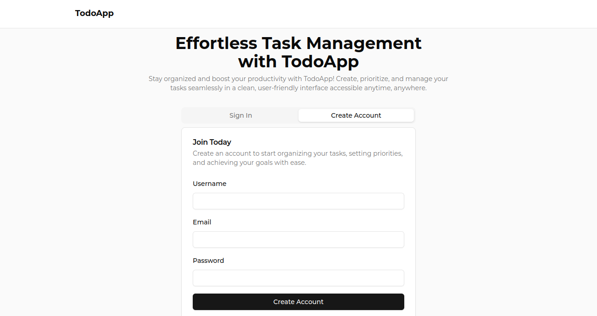
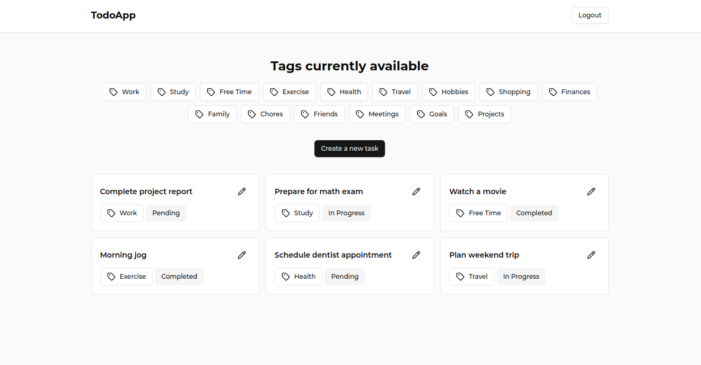
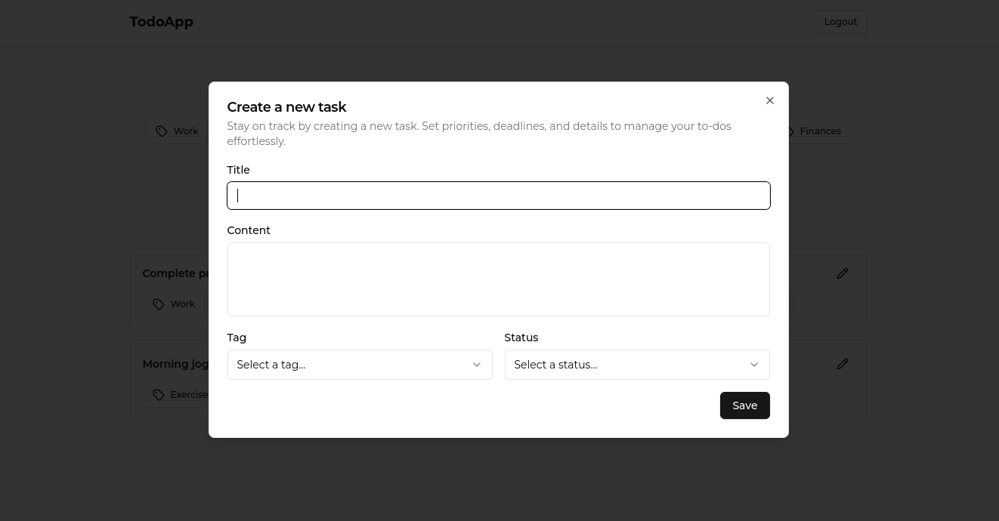
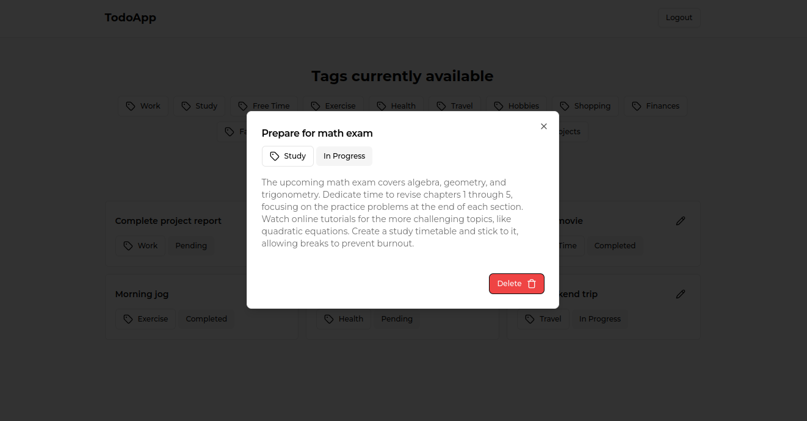
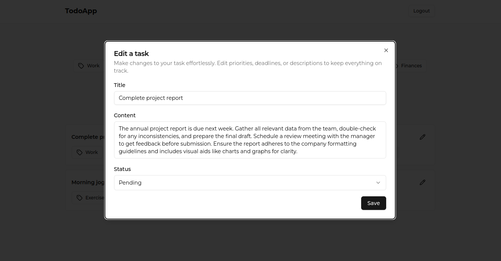

# ABOUT
This github project is taken from ```https://github.com/Remy349/todo-app-flask-reactjs```.
If you want to setup the whole project locally please go and checkout the repo.

<strong> Use this repo to run the project on docker and practise for docker containerisation </strong>

### Changes
- Clone the repo
- Docker and docker compose must be installed
- Just run ```docker compose build```
- Then after build run ```docker compose up```
- Now hit ```localhost``` and create new account and u are good to go

### Notes
- It runs on ```localhost:80``` so the must not be occupied by any other service or app
- The backend run on ```localhost:5000``` this port must not be occupied by any other django app


### REST API

Everything related to the API is inside `flaskr/routes`. The following table summarizes the routes that were implemented:

| HTTP Method | Resource URL            | Notes                                   |
| ----------- | ----------------------- | --------------------------------------- |
| `POST`      | */api/v1/auth/sign-in*  | Auth user and create JWT                |
| `GET`       | */api/v1/users*         | Get a list of all users                 |
| `POST`      | */api/v1/users*         | Create a new user                       |
| `GET`       | */api/v1/users/id*      | Get a single user by id                 |
| `DELETE`    | */api/v1/users/account* | Delete a user account                   |
| `GET`       | */api/v1/tags*          | Get a list of tags                      |
| `POST`      | */api/v1/tags*          | Create a new tag                        |
| `POST`      | */api/v1/tasks*         | Create a new task                       |
| `GET`       | */api/v1/tasks/user*    | Get a list of all tasks on user         |
| `PUT`       | */api/v1/tasks/id*      | Update a task                           |
| `DELETE`    | */api/v1/tasks/id*      | Delete a task                           |

## Image gallery

### REST API Preview:




### Frontend Preview








### Changes by Mr. Ujjwal Gupta
